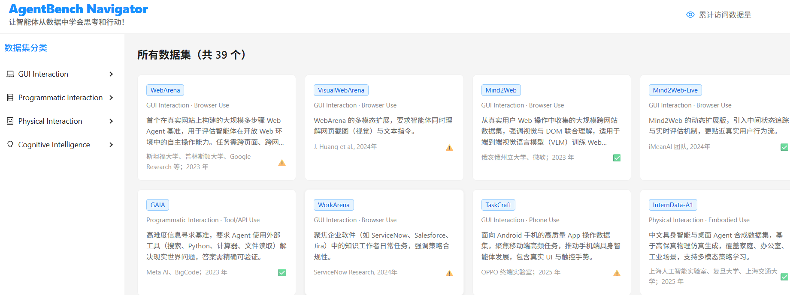
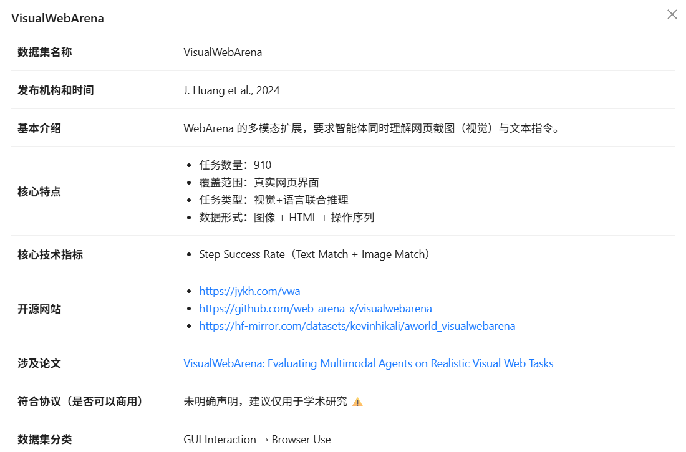

CN [中文](README_zh.md) | EN [English](README.md)

# 🧠 Awesome Agent Benchmarks

A curated collection of the world’s most advanced benchmark datasets for evaluating Large Language Model (LLM) Agents. Covers core capabilities including **tool use**, **multi-turn dialogue**, **code generation**, **planning & reasoning**, and **real-world task execution**—empowering researchers and developers to efficiently assess agent performance.

---

## ✨ Why This Collection?

As LLM Agent technology advances rapidly, standardized benchmarks have become the essential “ruler” for measuring real-world capabilities. However:

- Datasets are scattered across GitHub, Hugging Face, and paper appendices—hard to discover  
- Lack of unified taxonomy and key metric comparisons makes cross-evaluation difficult  
- New benchmarks emerge constantly, leading to outdated or incomplete lists  

**AgentBench Navigator** solves these problems by offering:
- Manually vetted, high-quality agent evaluation datasets  
- Structured categorization and metadata  
- Continuous updates to keep pace with the latest research  

Save hours of research time—get straight to what matters.

---

## 🔍 Featured Datasets

| Dataset | Links |
|--------|-------|
| **WebArena** | [Website](https://webarena.dev) \| [GitHub](https://github.com/web-arena/WebArena) |
| **VisualWebArena** | [Demo](https://jykh.com/vwa) \| [GitHub](https://github.com/web-arena-x/visualwebarena) \| [Hugging Face](https://hf-mirror.com/datasets/kevinhikali/aworld_visualwebarena) |
| **Mind2Web** | [HF Dataset](https://huggingface.co/datasets/Mind2Web) \| [Project Page](https://osu-nlp-group.github.io/Mind2Web/) \| [GitHub](https://github.com/OSU-NLP-Group/Mind2Web) |
| **Mind2Web-Live** | [HF Dataset](https://huggingface.co/datasets/iMeanAI/Mind2Web-Live) |
| **GAIA** | [HF Dataset](https://huggingface.co/datasets/gaia-benchmark/GAIA) |
| **WorkArena** | [GitHub](https://github.com/ServiceNow/WorkArena) |
| **TaskCraft** | [Website](https://taskcraft.ai) \| [HF Dataset](https://huggingface.co/datasets/oppo-research/TaskCraft) |
| **InternData-A1** | [HF Dataset](https://huggingface.co/datasets/InternRobotics/InternData-A1) |
| **ToolBench** | [HF Dataset](https://huggingface.co/datasets/OpenBMB/ToolBench) \| [GitHub](https://github.com/OpenBMB/ToolBench) |
| **API-Bank** | [ModelScope](https://modelscope.cn/datasets/Tongyi-Laboratory/API-Bank) |
| **SWE-bench** | [Website](https://swebench.com) \| [GitHub](https://github.com/princeton-nlp/SWE-bench) |
|....... | ....... |
 
> 💡 Explore the full list online → [AgentBench Navigator](https://www.dataanswer.top/)

---

## 🤝 How to Contribute

We welcome all forms of contributions! Help make this list even better:

- **Add a new dataset**: Found a high-quality Agent benchmark not listed? Open an Issue or PR!
- **Fix inaccuracies**: Broken links? Outdated descriptions? Please correct them.
- **Improve metadata**: Add missing fields like task count, domain, or evaluation metrics.

Your contribution will help the entire AI agent community!

---

## 📄 License

- **Website code**: MIT License — free to use, modify, and distribute.  
- **Dataset metadata** (descriptions, categories, links): [CC BY 4.0](https://creativecommons.org/licenses/by/4.0/)  
  ✅ Commercial & non-commercial use allowed  
  ✅ Modification and redistribution allowed  
  ⚠️ **Attribution required**: Please credit the original author and link back to this repository.

© 2025 XuChao. Some rights reserved.

---

## 🙏 Acknowledgements

- Thanks to all open-source Agent benchmark teams and maintainers  
- Inspired by the [Awesome Lists](https://github.com/sindresorhus/awesome) series  
- Special thanks to early beta users for valuable feedback

---

## 📬 Contact

Have questions, collaboration ideas, or want to discuss agent evaluation? Reach out via:

- GitHub: [@dataanswer](https://github.com/dataanswer)  
- Email: [dataanswer@163.com](mailto:dataanswer@163.com)

> Let every agent capability evaluation be evidence-based.

Maintained by **DataAnswer (XuChao)** since 2025.
